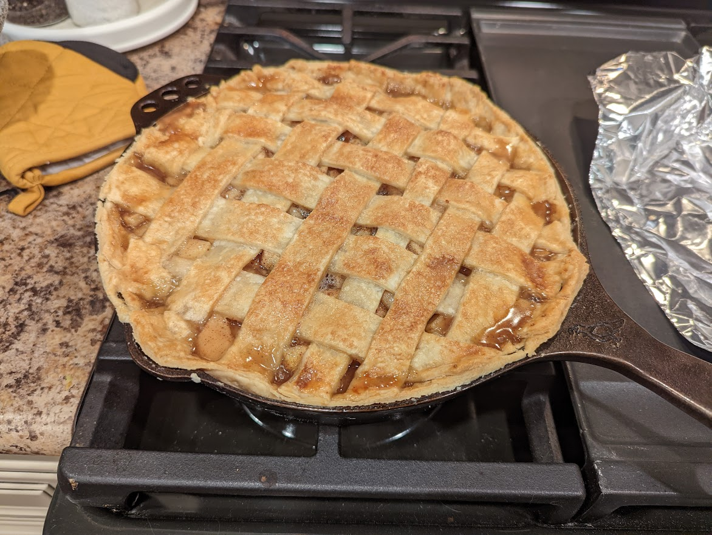

# Deep Dish Apple Pie:

## Homemade Pie Crust Recipe:

* 2-1/2 C / 315g _all-purpose flour_
* 1 t _salt_
* 6 T _butter_ (chilled & cubed)
* 2/3 C _lard_
* 1/2 C / 120ml _water_ (with ice cubes/extra cold)

[Original recipe link](https://sallysbakingaddiction.com/baking-basics-homemade-buttery-flaky-pie-crust/)

### Steps:

1. Wisk _flour & salt_ in large bowl
2. Add _lard, butter_ and cut in with pastry cutter until pea-sized mealy bits
3. Drizzle cold _water_ 1T at a time and stir in with spatula.  **STOP when dough forms large clumps, that's enough!!** 
4. Work on a floured surface, should not be overly sticky.  **Don't overwork the dough** 
5. Halve and form into 1" thick rounds, cover and put in fridge for >= 2hrs < 5 days

> When ready to use, roll it out gently with a floured rolling pin.  Specs of lard still in it is totally normal and to be expected.  
> use the rolling pin to help pick it up and transfer it ot your cast iron pan.  This recipe makes enough for the top lattice-work as well. 

## Deep-dish Apple Pie Recipe:

* 8-9 _apples_, peeled and sliced into 1/4" slices
* 1/2 C / 100g _granulated sugar_
* 1/4 C / 31g _all-purpose flour_
* 1 T / 15ml _lemon juice_
* 1-1/2 t _ground cinnamon_
* 1/4 t ground _allspice_ 
* 1/4 t ground _nutmeg_
* egg wash (1 lg egg 1T milk)
* _coarse sugar_ for crust sprinkles

[Original recipe link](https://sallysbakingaddiction.com/deep-dish-apple-pie/)

1. Stir together the _apple slices, flour, lemon juice, cinnamon, allspice, nutmeg_ and set aside to rest  
2. pre-heat oven to **400F**
3. Assemble pie like is typical and complete the lattice-work. Sprinkle _coarse sugar_ on top for decoration
4. Bake for 25 mins, turn down temp to 375F, cover top with tin foil, continue to bake for addl 30-35min
5. **Allow to cool at least 3 hrs before eating**
